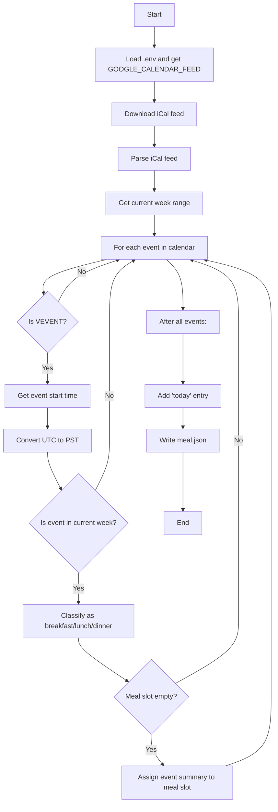

# Meal Plan Extractor

This Python script extracts meal events from a Google Calendar iCal feed, classifies them as "breakfast", "lunch", or "dinner" based on their start time (in Pacific Time), and outputs a `meal.json` file for the current week.

## Features

- Fetches events from a Google Calendar iCal feed (URL stored in a `.env` file)
- Converts event times from UTC to Pacific Time (PST/PDT)
- Classifies events into breakfast, lunch, or dinner based on start time:
  - Breakfast: 8:00am–10:59am
  - Lunch: 11:00am–4:59pm
  - Dinner: 5:00pm and later
- Only includes events from the current week (Monday–Sunday)
- Outputs a `meal.json` file with a summary for each day and a special `today` entry

## Requirements

- Python 3.7+
- Install dependencies:

```
pip install -r requirements.txt
```

## Setup

1. Clone this repository or copy the script files to your project directory.
2. Create a `.env` file in the project root with your Google Calendar iCal feed URL:

```
GOOGLE_CALENDAR_FEED=https://calendar.google.com/calendar/ical/your-feed-url/basic.ics
```

3. (Optional) Create and activate a virtual environment:

```
python3 -m venv .venv
source .venv/bin/activate
```

## Usage

Run the script:

```
python extract_meals.py
```

This will generate a `meal.json` file in the same directory, with the following format:

```
{
  "0": {"breakfast": "...", "lunch": "...", "dinner": "..."},
  ...
  "6": {"breakfast": "...", "lunch": "...", "dinner": "..."},
  "today": {"breakfast": "...", "lunch": "...", "dinner": "...", "Date": "July, 30, 2025"}
}
```

- Keys `0`–`6` correspond to Monday–Sunday (Python weekday index).
- If no event is found for a meal, the value is an empty string.

## Notes

- The script expects all event times in the calendar feed to be in UTC.
- Only the first event per meal per day is recorded.
- All-day events are treated as starting at midnight UTC (5pm previous day PST).

## Logic Flow Diagram



## License

MIT
